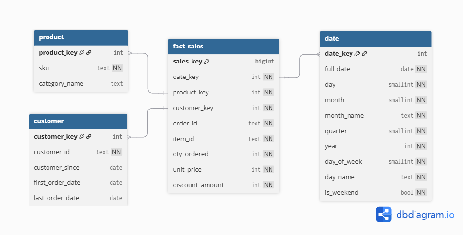

## Overview
This project showcases my ability to design and implement an end-to-end reproducible local ETL pipeline, transforming raw Pakistan e-commerce data into a clean, structured PostgreSQL analytical database using the star schema data modeling, ready for SQL-based analysis.

> [!NOTE]+ DESIGN INTENT
> This project prioritizes **analytical correctness, deterministic behavior, and reproducibility** over scale or performance optimization.  
> All layers are rebuilt explicitly to minimize hidden state and ambiguity.

---

## Project Context

This project is my **first end-to-end data engineering pipeline**, developed during **Phase 2** of my roadmap.

This pipeline focuses on:
- **analytical data modeling discipline**
- clearly defined **layer boundaries**
- enforceable **data quality contracts**

The objective is not to simulate production scale, but to design a pipeline that is **easy to reason about, easy to audit, and safe for analytics**.

---

## Business Problem
E-commerce data often arrives as flat CSV files that:

- mix transactional and analytical concerns
- store values as loosely typed fields
- lack explicit grain definitions
- provide no guarantees around referential integrity

Without a well-defined analytical model, SQL queries may execute successfully while producing **misleading analytical results**.

---

## Architectural Principles

This pipeline is built around a small set of explicit principles:

- clarity over clever abstractions  
- deterministic rebuilds over incremental complexity  
- explicit contracts over implicit assumptions  
- fail-fast behavior for analytical correctness  

Every layer and transformation adheres to these constraints

---

## End-to-End Pipeline
```text
Raw CSV → Raw Layer → Staging Layer → Data Quality (Soft Warning) → Foundation Layer → Data Quality (Fail Hard) → Business Marts
```
Each layer has a **single, non-overlapping responsibility**.

---

### Raw Layer - Design Rationale

The raw layer is designed as a **1:1 snapshot of the source data**.

Data is ingested directly from the source without structural transformation so that any change in the upstream source can always be traced back to this layer. By preserving the raw data exactly as it arrives, the pipeline maintains a reliable reference point for validation, debugging, and historical comparison across runs.

This approach improves data trustworthiness by **minimizing the risk of data loss or unintended alteration** during ingestion.

The primary trade-off is increased storage usage, as raw data is fully retained rather than transformed or discarded early. However, this cost is accepted intentionally in exchange for **stronger data integrity guarantees**.

Additionally, persisting raw data inside the database eliminates the need to repeatedly re-import source files when inspecting or validating raw records, reducing operational friction during development and analysis.

---

### Staging Layer - Design Rationale

The staging layer exists to **clean and standardize raw data** so it can be safely used to build the star schema.

At this stage, the data still closely resembles the raw source, but structural issues are resolved through:
- explicit type casting
- format standardization
- basic data cleaning

No aggregations or business logic are applied in the staging layer. This is intentional.  
The goal is not to derive insights, but to ensure that the data is **technically correct, consistently typed, and ready for modeling**.

By isolating type casting and standardization in the staging layer, the pipeline avoids mixing ingestion concerns with analytical logic. This makes downstream transformations more predictable and reduces ambiguity when building dimension and fact tables.

In short, the staging layer acts as a **technical preparation layer**: the data is no longer raw, but it is not yet analytical.

---

### Foundation Layer - Design Rationale



The foundation layer is the **core of the pipeline** and represents the canonical analytical model.

This layer implements a **Kimball-style star schema**, where data is enriched and transformed into well-defined dimension and fact tables. At this stage, the data is already analytical in nature, with explicit grain definitions and controlled transformations.

The foundation layer is intentionally separated from the marts layer.  
Although it uses a star schema, this layer is **not designed for direct consumption by data analysts or data scientists**.

This separation introduces an intentional trade-off.

On the downside, it creates a potential bottleneck on the data engineering side. Business marts may change frequently, and exploratory analysis can become slower because consumers do not directly query the foundation tables.

However, this cost is accepted deliberately to preserve **grain integrity and analytical correctness**.  
By enforcing a stable canonical model, the foundation layer minimizes the risk of subtle analytical errors (so-called *silent bugs*) that can arise when aggregations or reshaping are performed inconsistently.

These silent bugs are particularly dangerous, as they can degrade data quality over time and ultimately erode trust in analytical outputs.

In this design, the foundation layer acts as a **protected analytical contract**: correctness and consistency are prioritized over convenience.

> [!WARNING]+ DATA CONTRACT
> The foundation layer is protected by **blocking data quality checks**.  
> If any check fails, the pipeline must stop and downstream marts must not be built.

---

### Marts Layer - Design Rationale

The marts layer is the **final consumption layer**, where data is prepared for direct use by downstream users.

This layer contains a small set of business marts, each built with a **specific and intentionally fine-grained grain**.  
For example, transactional data is modeled at a daily level so it can be safely re-aggregated into weekly or monthly views as needed.

The marts are designed to be **cheap and flexible**:
- they can be modified, extended, or added without changing the foundation layer
- they adapt to evolving analytical and business requirements

This flexibility comes with an explicit trade-off.  
Because marts are closely aligned with business questions, they require **more frequent communication between data engineers and data consumers**, and demand a stronger understanding of business context from the engineering side.

However, this cost is accepted deliberately.  
By keeping business-specific reshaping and aggregation confined to the marts layer, the pipeline preserves **data quality and analytical correctness** upstream, while allowing downstream use cases to evolve without compromising the integrity of the canonical model.

---

## Data Quality Strategy
Data quality is treated as a **core responsibility of the pipeline**, but it is enforced in a way that avoids unnecessary complexity.

### Early Data Quality Checks 

Early data quality checks are executed **after the staging phase**.  
This placement is intentional, as the staging layer is the first point where data has been:
- standardized
- normalized
- explicitly type cast

At this stage, the data is structurally ready to be evaluated for analytical use, making it the most appropriate layer for initial quality assessment before building the foundation model.

These checks are **non-blocking** and produce warnings only.  
The purpose is not to enforce strict correctness, but to:
- observe the condition of the data
- validate initial assumptions
- understand how messy or inconsistent the source data actually is

Failing the pipeline at this stage would be premature.  
Early checks are designed for **observability and awareness**, not enforcement.

### Final Data Quality Checks

Final data quality checks are executed **after the foundation layer is built**, once the star schema analytical model is fully formed.

This placement is intentional. Before data is reshaped into marts and exposed to downstream users, it must be **fully ready for consumption**. At this stage, the pipeline assumes that all structural and modeling decisions have already been applied, and what remains is to verify analytical correctness.

The role of final data quality checks can be compared to a **quality control step in a kitchen**.  
Before a dish is plated and served, the chef ensures that the food is properly cooked, safe to eat, and meets the expected standard. Similarly, before data is presented to users, it must be validated as complete, consistent, and trustworthy.

Unlike early checks, final checks are **strict and blocking**.  
If any validation fails, the pipeline stops immediately. This is intentional, as downstream users must never consume data that is incorrect, incomplete, or misleading.

At this point, data quality enforcement prioritizes **consumer safety over pipeline continuity**.  
Failing fast is preferable to silently delivering analytically unsafe data that could compromise insights and erode trust.

---

## Why Full Rebuild?

This pipeline intentionally avoids incremental logic and relies on **full rebuilds**.

This decision is driven by the characteristics of the data and the goals of the system:
- the data is processed as a single batch
- deterministic outcomes are prioritized over throughput
- fewer failure modes make the pipeline easier to reason about
- debugging and auditing are significantly simpler without hidden state

By rebuilding the analytical layers on every run, the pipeline produces **predictable and explainable behavior**.  
Given the same input, the output is always the same, making errors easier to detect and diagnose.

> [!TIP]+ DESIGN TAKEAWAY
> * For **single-batch analytical systems**, deterministic full rebuilds often provide more value than incremental optimization.  
> * Different data characteristics require different design choices.

---

## What This Project Demonstrates

This project demonstrates:
- disciplined **analytical data modeling** using a Kimball-style star schema
- explicit **data contracts and layer responsibilities**
- **practical data quality enforcement** aligned with analytical consumption
- a **reproducible ETL design** built for single-batch data
- appropriate use of **SCD Type 1** given the absence of historical requirements

---

## References

- GitHub Repository: [ecommerce data pipeline](https://github.com/faqihalamin95/ecommerce-data-pipeline)
- Phase 2 Reflection: [Closing Phase 2 Why My First End-to-End Pipeline Broke Until I Learned Data Modeling](https://datadonut.netlify.app/blog/closing-phase-2/)