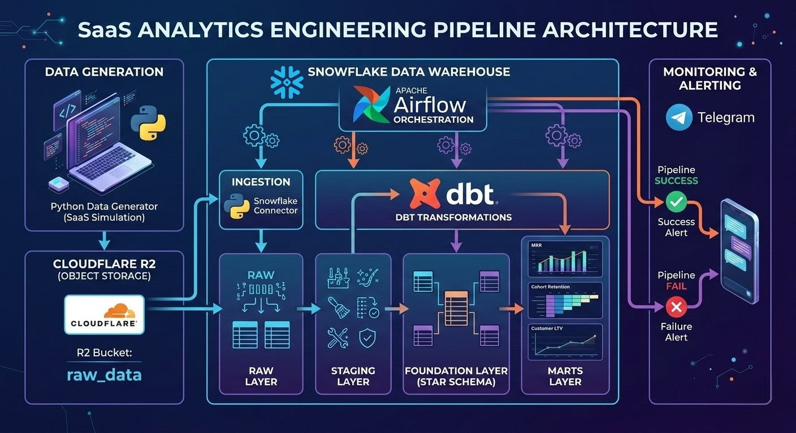
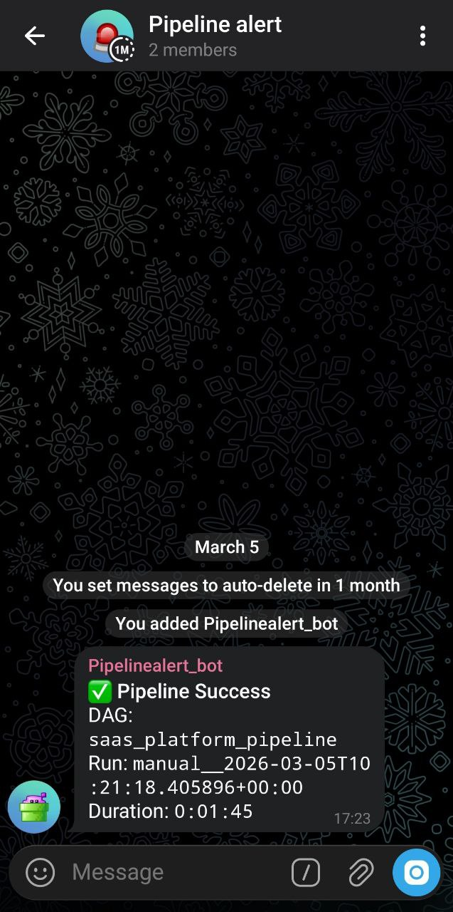

## Overview

This project demonstrates the design of an **end-to-end analytics engineering pipeline for a SaaS subscription business**.

The pipeline simulates operational SaaS activity, ingests the generated data into analytical infrastructure, and transforms it into a structured dimensional model suitable for analytical workloads.

The primary focus of the project is not dashboard creation, but rather **pipeline architecture, data modeling discipline, and analytical correctness**.

The system evolves in two stages:

-   a **local development stack** for experimentation and modeling.
-   a **cloud-based analytics pipeline** simulating a production-style environment.

> DESIGN INTENT\
> This project prioritizes **architectural clarity, deterministic
> transformations, and explicit analytical models** over scale or
> performance optimization.

------------------------------------------------------------------------

## Business Problem

Operational SaaS systems generate **multiple streams of events**:

-   subscription lifecycle events
-   payment transactions
-   product usage activity
-   user account records

In theory, these events should make it easy to answer fundamental business questions:

-   Is recurring revenue growing?
-   Are users retaining or churning?
-   Which subscription plans generate the most revenue?

In practice, however, raw operational data rarely arrives in a form that is immediately suitable for analytics.
Real-world SaaS data pipelines must deal with a wide range of instability, including:

-   **Duplicate events**, often caused by retry mechanisms
-   **Late-arriving data**, where events appear days after they actually occurred
-   **Schema inconsistencies**, especially during product evolution
-   **Marketing-driven noise**, such as referral campaigns introducing unexpected fields
-   **Operational spikes**, where sudden traffic surges produce unusual event patterns

These issues are not rare edge cases, they are normal characteristics of production systems. As a result, a pipeline can run successfully while still producing **incorrect analytical results**.

This creates a subtle but dangerous failure mode:
the system appears healthy, but the metrics it produces are misleading.

For analytics systems supporting business decisions, **incorrect metrics are often worse than missing metrics**.

------------------------------------------------------------------------

## Defining the Analytical Guarantees

Before designing any analytics pipeline, it is important to define **what guarantees the system is expected to provide**.

Operational data pipelines can often run successfully while still producing misleading metrics. This happens when transformations succeed technically but violate analytical assumptions such as event ordering, uniqueness, or consistent dimensional attributes.

To avoid these failure modes, the pipeline in this project is designed around a small set of explicit analytical guarantees.
________________________________________
### 1. Metric Consistency

Business metrics must remain consistent across queries and analytical models.
For example, calculations such as:
-   Monthly Recurring Revenue (MRR)
-   churn rate
-   retention cohorts

should produce the same results regardless of where they are queried from within the analytics layer.
This requires:
-   well-defined event grains
-   consistent dimensional joins
-   clearly separated fact tables

Without these constraints, different queries may unintentionally compute the same metric in different ways.
________________________________________
### 2. Deterministic Transformations

All transformations in the pipeline are designed to be deterministic. Given the same input data, the pipeline should always produce the same analytical outputs.

This requirement eliminates hidden dependencies such as:
-   non-deterministic ordering
-   implicit deduplication logic
-   transformations that depend on execution timing

Deterministic transformations make analytical results **reproducible and debuggable**.
________________________________________
### 3. Explicit Analytical Grain

Each analytical dataset must define a clear **grain**.

For event-based analytics, this means that every fact table represents a single type of business event.

For example:
-   fct_payments              → one payment transaction
-   fct_subscription_events   → one subscription lifecycle event
-   fct_product_events        → one product interaction

This prevents ambiguous joins and reduces the risk of double counting. Explicit grain definitions are essential when working with event-driven SaaS datasets.
________________________________________
### 4. Traceability to Source Data

The pipeline must preserve a clear lineage between analytical models and the original event data. This requirement ensures that analytical anomalies can always be traced back to their source.

To support this, the pipeline maintains a **raw data layer** where events are stored with minimal modification.

Traceability makes it possible to investigate issues such as:
-   duplicate payment records
-   unexpected plan changes
-   timestamp anomalies

without losing access to the original data.
________________________________________
### 5. Failure on Data Quality Violations

Perhaps the most important guarantee is that the pipeline fails when analytical correctness is at risk.

Many pipelines treat data quality checks as warnings. However, allowing the pipeline to continue in the presence of severe anomalies can silently corrupt business metrics.

In this design, certain conditions intentionally trigger pipeline failure.

Examples include:
-   abnormal spikes in duplicate events
-   unexpected null increases in critical fields
-   schema inconsistencies affecting analytical joins

When these conditions occur, the pipeline stops and emits operational alerts. This approach prioritizes analytical correctness over pipeline availability.

In other words, the system is designed around the principle that:

producing incorrect metrics is worse than temporarily producing no metrics at all.

------------------------------------------------------------------------

## What the Pipeline Ultimately Produces

Once the analytical guarantees are defined, the next step is determining what the pipeline must ultimately produce.

The goal of the system is not simply to move data between services, but to transform operational SaaS events into **reliable analytical datasets** that can support business decision making.

To achieve this, the pipeline automates the full lifecycle of data processing using a modern analytics stack.

At a high level, the system performs the following sequence of operations:


Each stage represents a distinct responsibility in the pipeline.
________________________________________
-   ### Automated Data Pipeline

The pipeline begins with a **Python-based synthetic data generator** that simulates operational SaaS activity.

The generator produces event datasets such as:
-   user registrations
-   subscription lifecycle events
-   payment transactions
-   product usage events

These datasets are written as **Parquet files**, which represent a common format used for event-based data storage.

The generated files are then uploaded to **Cloudflare R2**, which acts as the object storage layer for raw event data.

From there, the pipeline ingests the data into **Snowflake**, where it becomes the **raw analytical layer** of the warehouse.

Once the data is available in Snowflake, transformations are executed using **dbt**, which organizes the analytical models into structured layers.

The pipeline transforms the raw event data through several stages:

```text
RAW → STAGING → FOUNDATION → MARTS
```
These transformations convert loosely structured event streams into a clean dimensional model suitable for analytics.

All ingestion and transformation steps are orchestrated using **Apache Airflow**, allowing the entire pipeline to run automatically according to a defined workflow.
________________________________________
-   ### Analytical Outputs

The primary analytical output of the pipeline is a structured dataset designed for subscription analytics.

At the core of the analytical model is a **dimensional star schema**, which organizes the event data into clear fact tables and dimensions.

This structure enables the creation of higher-level business models, including:
-   **Monthly Recurring Revenue (MRR)**
-   **Cohort Retention Analysis**
-   **Customer Lifetime Value (LTV)**

These models represent the types of metrics commonly used to evaluate SaaS performance.

The result is a dataset that allows analysts to reliably answer questions such as:
-   how revenue evolves over time
-   how long customers stay subscribed
-   how product usage relates to long-term value
________________________________________
-   ### Operational Outputs

In addition to analytical datasets, the pipeline also produces **operational signals that indicate whether the system is functioning correctly**.

Pipeline execution is orchestrated by **Apache Airflow**, which manages the dependency graph between ingestion and transformation tasks.

Airflow also acts as the monitoring layer for the pipeline.

During execution, the system sends **Telegram notifications** indicating the status of the workflow.

Two primary outcomes are reported:
-   **Pipeline success**, when all tasks complete successfully
-   **Pipeline failure**, when any stage of the pipeline encounters an error or data quality violation



These alerts provide lightweight observability into the pipeline without requiring a dedicated monitoring platform.


------------------------------------------------------------------------

## Why the Pipeline Uses a Layered Analytics Architecture

Most modern analytics pipelines separate transformations into multiple logical layers.

A common structure looks like this:
```text
RAW → STAGING → FOUNDATION → MARTS
```
Each layer exists for a specific purpose and isolates different types of transformations.

This layered design helps prevent a common problem in data pipelines: **mixing ingestion logic, technical cleanup, and business modeling in the same transformation step**.

In earlier projects ([e-commerce data pipeline](https://datadonut.netlify.app/projects/ecommerce-data-pipeline/)), I implemented this structure with a strict separation between the analytical model and the business consumption layer. The experience from that design strongly influenced the architecture used in this project.
________________________________________
### 1. Raw Layer - Preserving Source Truth

The raw layer is designed as a **1:1 snapshot of the source data**.

Data is ingested directly from the source without structural transformation so that any change in upstream systems can always be traced back to this layer.

By preserving the raw data exactly as it arrives, the pipeline maintains a reliable reference point for:
-   validation
-   debugging
-   historical comparison across runs

This approach improves data trustworthiness by minimizing the risk of accidental data loss or unintended alteration during ingestion.

Another practical benefit is operational simplicity. 
Persisting raw data inside the warehouse eliminates the need to repeatedly reload source files when investigating anomalies.

The trade-off is increased storage usage, since raw data is fully retained rather than transformed or discarded early. However, this cost is accepted deliberately in exchange for stronger data integrity guarantees.
________________________________________
### 2. Staging Layer - Technical Standardization

The staging layer exists to **clean and standardize raw data** before it is used to construct the analytical model.

At this stage, the data still closely resembles the raw source, but structural issues are resolved through transformations such as:
-   explicit type casting
-   timestamp normalization
-   format standardization
-   basic structural cleanup

Importantly, **no business logic is introduced in the staging layer**.

The goal is not to derive insights yet, but to ensure the data is technically consistent and ready for modeling.

By isolating type casting and normalization here, downstream models become significantly easier to reason about. Analytical transformations no longer need to deal with low-level data inconsistencies.

In short, staging acts as a **technical preparation layer**: the data is no longer raw, but it is not yet analytical.
________________________________________
### 3. Foundation Layer - The Canonical Analytical Model

The foundation layer contains the **core analytical data model**.

This layer implements a Kimball-style **star schema**, where event data is organized into well-defined fact tables and dimensions.

Each table has a clearly defined grain, and relationships between facts and dimensions are explicitly controlled.

In earlier pipeline designs ([e-commerce data pipeline](https://datadonut.netlify.app/projects/ecommerce-data-pipeline/)), this layer was treated as a **protected canonical model** that was not queried directly by analysts. Instead, all downstream consumption occurred through business-specific marts.

This design introduced a deliberate trade-off.

Restricting direct access to the foundation model improved analytical consistency and reduced the risk of subtle errors such as **double counting or inconsistent aggregations**.

However, it also created a bottleneck for exploratory analysis.

Business marts had to be created or modified every time analysts wanted to explore the data from a new perspective.

**Adapting the Model for SaaS Analytics**

In fast-moving SaaS environments, this strict separation can become counterproductive.

Unlike traditional transactional domains such as e-commerce, SaaS analytics often requires **rapid exploratory analysis across multiple dimensions of product usage and subscription behavior**.

Analysts frequently need to:
-   drill into subscription lifecycle events
-   explore product interaction patterns
-   investigate retention or churn anomalies

Creating a dedicated mart for every analytical question can slow down this process significantly.

For this reason, the design in this project intentionally allows the **star schema in the foundation layer to be queried directly**.

This provides analysts with a flexible analytical base where they can perform exploratory queries without waiting for new marts to be created.

The trade-off is that analysts must understand the grain and structure of the underlying fact tables.

However, in SaaS environments where analysts are often deeply familiar with product behavior, this flexibility tends to outweigh the risks.

In this architecture, the foundation layer serves two roles simultaneously:
-   a stable canonical analytical model
-   a flexible base for exploratory analysis
________________________________________
### 4. Marts Layer - Business-Specific Metrics

The marts layer remains the final consumption layer, but its purpose shifts slightly in this architecture.

Instead of acting as the only interface for analytics, marts now focus primarily on **curated business metrics**.

Examples include:
-   **Monthly Recurring Revenue (MRR)**
-   **cohort retention models**
-   **customer lifetime value (LTV)**

These models encode business definitions that should remain consistent across teams.

Because marts sit downstream from the canonical star schema, they can evolve independently without affecting the integrity of the core analytical model.

This design preserves a balance between:
-   **analytical flexibility** for exploration
-   **stable business metrics** for reporting


------------------------------------------------------------------------

## A Local-First Development Strategy

Before building the full cloud pipeline, the analytical model in this project was first developed in a local environment.

There were two main reasons for this decision.

**First**, this project represents an exploration of **SaaS analytics patterns**, including subscription lifecycle modeling and recurring revenue metrics.

Developing the transformations locally made it possible to iterate quickly while understanding the structure of the data and the analytical questions the system needs to answer.

**Second**, cloud infrastructure introduces operational complexity and cost.

Services such as cloud warehouses and orchestration platforms are powerful, but they also make experimentation slower and more expensive during the early stages of development.

For these reasons, the initial phase of the project focused on **establishing a stable analytical foundation locally before introducing cloud infrastructure**.

By performing the initial modeling locally, the project avoids these costs while still allowing the analytical logic to mature.

Once the data model and transformation structure become stable, the pipeline can then be migrated to a cloud environment with greater confidence.

------------------------------------------------------------------------

## Transitioning to a Cloud Analytics Architecture

Once the analytical model became stable in the local environment, the next step was to move the pipeline into a **cloud-based architecture**.

The goal of this transition was not simply to move data processing to the cloud, but to introduce several capabilities that are difficult to replicate in local workflows:

-   automated pipeline orchestration
-   centralized analytical storage
-   reproducible scheduled execution
-   operational monitoring

Rather than building a complex infrastructure stack, the architecture intentionally uses a **small set of well-established tools from the modern analytics ecosystem**. Each component serves a specific role in the pipeline.
________________________________________
-   ### Object Storage: Cloudflare R2

The pipeline uses **Cloudflare R2** as the object storage layer for raw event data.

R2 serves a similar role to services such as **Amazon S3**: it stores immutable files that represent the original event data generated by the system.

One of the main motivations for choosing R2 is **cost efficiency**.
Compared with many cloud storage solutions, R2 provides competitive storage pricing while still supporting the same object storage paradigm.

Another advantage is **ecosystem compatibility**.
R2 follows an S3-compatible API, which means that the pipeline design remains portable. If the system later needs to migrate to Amazon S3 or another object storage provider, the transition can be performed with minimal architectural changes.

This makes R2 a practical choice for projects that aim to simulate real-world data platforms without introducing unnecessary infrastructure cost.
________________________________________
-   ### Data Warehouse: Snowflake

The analytical warehouse used in this project is **Snowflake**.

Snowflake has become a widely adopted platform in modern analytics engineering because it separates compute and storage while providing a SQL-first analytical environment.

For this pipeline, Snowflake serves as the central system responsible for:
-   storing the raw analytical layer
-   executing SQL transformations
-   supporting dimensional models and business marts

Because Snowflake is designed specifically for analytical workloads, it integrates naturally with tools such as dbt and orchestration frameworks.

Using Snowflake also reflects common patterns in modern data teams, where the warehouse becomes the primary environment for both transformation and analysis.
________________________________________
-   ### Transformation Layer: dbt

Transformations inside the warehouse are implemented using **dbt (data build tool)**.

dbt provides a structured framework for organizing SQL transformations into modular models. Instead of writing large, hard-coded SQL scripts, transformations are defined as reusable models with explicit dependencies.

**This approach offers several advantages**.

**First**, it reduces repetitive SQL patterns that commonly appear in data pipelines.
Transformations can be structured and version-controlled in a way that resembles software engineering workflows.

**Second**, dbt makes it easier to introduce **automated testing and documentation**.

Features such as **dbt tests** allow the pipeline to enforce data quality checks directly within the transformation layer, ensuring that critical assumptions about the data are validated during execution.

**Finally**, dbt fits particularly well in organizations where the data platform is evolving quickly.
Because transformations are modular and declarative, new models can be added or modified without rewriting the entire pipeline.
________________________________________
-   ### Pipeline Orchestration: Apache Airflow

To automate the execution of the entire pipeline, the system uses **Apache Airflow** as the orchestration layer.

Airflow manages the workflow that connects each stage of the pipeline, including:
-   data ingestion
-   transformation execution
-   data quality checks
-   downstream model builds

By defining these tasks as a directed acyclic graph (DAG), Airflow ensures that each stage runs in the correct order and only after its dependencies have completed successfully.

**Automation plays an important role here**.

Without orchestration, many steps in the pipeline would require manual execution, increasing both operational overhead and the risk of human error.

With Airflow managing the workflow, the pipeline can run automatically on a schedule. This allows the system to operate continuously without requiring manual intervention.

In practice, this means that engineering time can be focused more on **improving analytical models and investigating insights**, rather than repeatedly executing pipeline tasks.
________________________________________
-   ### Operational Monitoring: Telegram Alerts

Even with automated orchestration, pipelines require monitoring.

To provide lightweight observability, the system sends **Telegram alerts** when the pipeline completes execution.

Two primary outcomes are reported:
-   pipeline success
-   pipeline failure

These notifications allow the pipeline operator to immediately detect issues such as ingestion failures or failed transformations.

Telegram was chosen primarily because it is **simple, reliable, and essentially free to operate**.

Unlike full monitoring platforms, it does not introduce additional infrastructure or cost, yet still provides immediate visibility into pipeline status.

For a project of this scale, this lightweight approach strikes a practical balance between **observability and operational simplicity**.

------------------------------------------------------------------------

## Simulating Real-World Data Instability (Chaos Scenarios)

Data pipelines are often designed under the assumption that upstream systems produce clean and well-structured data.

In reality, operational data is rarely this predictable.
Production pipelines frequently encounter issues such as:
-   delayed events
-   duplicate records
-   schema changes
-   inconsistent categorical values
-   unexpected null spikes

Rather than treating these situations as rare edge cases, this project intentionally **simulates several common data instability scenarios**.

The goal is to ensure that the pipeline can handle messy input data while still producing reliable analytical outputs.

These scenarios are introduced deliberately during data generation and ingestion, creating a controlled form of **chaos testing for the analytics pipeline**.

Both the **local development stack** and the **cloud analytics stack** include their own chaos scenarios, reflecting different types of issues that occur in real data systems.
________________________________________
-   ### Chaos in the Local Development Stack

The local stack focuses on **data-level anomalies** that commonly occur in event-driven systems.

These scenarios test whether the analytical models remain correct even when upstream data evolves or behaves unexpectedly.

Five chaos scenarios are introduced in the local environment:

**1. Late Arriving Events**

Some events arrive later than when they actually occurred.

Approximately **3% of events are delayed by one month**, meaning the event timestamp and ingestion batch timestamp do not match.

This situation commonly occurs in production pipelines when upstream systems retry failed deliveries or when ingestion pipelines experience temporary delays.

**Handling strategy**

Rather than rejecting late events, the pipeline tracks them explicitly.
-   the original event_date represents when the event occurred
-   batch_month represents when the event arrived

Analytical queries are based on event_date, ensuring temporal accuracy.

Late events are therefore **accepted rather than discarded**, even though they may cause historical reports to change slightly over time.

This reflects a common trade-off in analytics systems:

**temporal accuracy is often more important than perfectly stable historical reports**.
________________________________________
**2. Plan Rename (Rebranding Event)**

At month six, the product plan **“Pro” is renamed to “Pro Plus”**.

Both names refer to the same underlying product but appear as different values in the event data.
This scenario simulates a typical business event such as product rebranding.

**Handling strategy**

The pipeline models this change using **Slowly Changing Dimension Type 2 (SCD Type 2)** in the dim_plans table.

Each version of the plan receives its own validity period.
This allows historical queries to correctly reflect the plan name that existed at the time of each event.

Importantly, the values are **not standardized into a single label**, because the change itself is analytically meaningful.

Tracking the rename makes it possible to analyze how the rebranding affects subscription behavior.
________________________________________
**3. Schema Evolution**

At month eight, new columns appear in the upstream dataset.

Two additional fields are introduced:
-   ingestion_source
-   promo_code

This scenario simulates a common production situation where upstream services deploy new event attributes without coordinating with downstream pipelines.

**Handling strategy**

The ingestion process dynamically adapts to schema changes.

If a column appears that does not exist in the database table, the ingestion script automatically performs an ALTER TABLE to add the missing column.

However, the pipeline still evaluates whether the new field has analytical value.
-   promo_code is retained because it may influence future marketing analysis
-   ingestion_source is dropped because it is purely technical metadata

This approach allows the pipeline to remain robust to schema changes while avoiding unnecessary data bloat.
________________________________________
**4. Duplicate Payments**

In month ten, approximately **2% of payment events are duplicated**.

Duplicate events are a common issue in distributed systems, often caused by retry mechanisms or idempotency failures.

Unlike some other anomalies, duplicates directly corrupt analytical metrics such as revenue totals.

**Handling strategy**

Duplicates are removed in the staging layer using window functions.

For each payment_id, the pipeline keeps the most recent record and discards the rest.

Additional dbt tests enforce that the cleaned dataset maintains a **unique payment identifier**, ensuring that duplicates cannot silently propagate downstream.
________________________________________
**5. Datatype Drift**

In month twelve, the amount_usd field changes from a numeric type to a string.

This situation simulates upstream systems that modify data serialization without updating downstream consumers.

**Handling strategy**

The staging layer performs **explicit type casting** to enforce the expected data type.

If invalid values appear that cannot be converted to numeric format, the transformation fails immediately.

Additional dbt tests verify that the resulting values are non-null and non-negative.

This follows a **fail-fast philosophy**: type errors should surface immediately rather than silently propagating into analytical models.
________________________________________
-   ### Chaos in the Cloud Analytics Stack

The cloud environment introduces a different category of instability.

While the local stack focuses on structural issues such as schema evolution and duplicates, the cloud stack simulates **business-driven anomalies and operational spikes**.

Four major chaos scenarios are introduced:

**1. Plan Migration (Month 3 Onward)**

Subscription plans are migrated from the previous naming convention:
-   Free → Starter
-   Pro → Growth
-   Business → Enterprise

However, the migration script introduces inconsistent variants such as:
-   GROWTH
-   Growht
-   rowth_plan

These messy values simulate real-world migrations where data transformations are not perfectly executed.

**Handling strategy**

The staging layer normalizes the plan values using conditional logic.

Values are cleaned using trimming and upper-case normalization before mapping them to a controlled set of valid plans.

At the same time, the pipeline preserves the original value in a separate column.
-   plan_raw      → original source value
-   plan_cleaned  → normalized canonical value

This approach preserves the source signal while still enabling consistent analytical modeling.
________________________________________
**2. Referral Code Noise**

Beginning in month eight, marketing campaigns introduce inconsistent referral code formats.

Examples include:

-   REF-123
-   ref_123
-   N/A
-   ""
-   ORGANIC

These inconsistencies are common in marketing attribution pipelines.

**Handling strategy**

The staging layer normalizes valid referral codes while converting invalid formats to null values.

This produces a cleaned column:
-   referral_code_cleaned

while maintaining analytical consistency in downstream models.
________________________________________
**3. Viral Usage Spike**

Starting in month ten, the system experiences a sudden growth surge where user activity increases roughly **fourfold**.

This surge produces unusually high event volumes and occasionally causes timestamp collisions.
Rather than artificially smoothing these spikes, the pipeline records them as signals.

**Handling strategy**

Events that arrive outside expected temporal patterns are flagged using an is_late_arriving indicator.
These signals are surfaced later in a dedicated **data quality mart**, allowing anomalies to be observed without distorting the analytical model.
________________________________________
**4. Null Spike in Plan Data**

During the same growth period, onboarding systems become temporarily overwhelmed.

As a result, approximately **30% of new subscription records contain null values for the plan field**.

**Handling strategy**

Instead of dropping these records, the pipeline preserves them while labeling the missing value as Unknown.

This ensures that anomalous behavior remains visible in the analytical layer rather than silently disappearing.

Null spikes are surfaced in a dedicated **data quality monitoring model**.
________________________________________
-   ### Layer Responsibilities for Chaos Handling

Across both environments, the pipeline follows a consistent philosophy for handling messy data.
Each transformation layer has a clearly defined responsibility.

**Raw layer**
-   store data exactly as received
-   no transformations applied

**Staging layer**
-   normalize formats
-   clean duplicates
-   cast types
-   flag anomalies

**Foundation layer**
-   enforce analytical structure
-   stop the pipeline if data becomes invalid

**Marts layer**
-   surface analytical insights
-   expose anomaly signals through monitoring models

This layered approach allows the pipeline to **separate data cleaning, anomaly detection, and analytical modeling**, ensuring that messy operational data does not silently corrupt business metrics.

------------------------------------------------------------------------

## Data Quality Policy

Designing the pipeline is not only about moving and transforming data, but also about defining **what level of data quality is acceptable**. 

In real systems, data is rarely perfect. Events may arrive late, values can be inconsistent, and upstream systems occasionally produce invalid records.

Because of that, this project adopts a clear data quality policy: not every anomaly should be silently fixed, but every anomaly should be observable.

### 1. Fail the Pipeline When Data Becomes Unsafe

Some issues indicate that the data is no longer reliable for analytics. When this happens, the pipeline should **stop immediately** rather than silently producing incorrect metrics.

The pipeline is designed to crash intentionally if critical constraints fail after the dimensional modeling stage, for example: 
-   invalid keys 
-   broken joins
-   major schema inconsistencies

This prevents corrupted data from propagating into downstream marts.

The failure event is captured by the orchestration layer, and a notification is sent through the monitoring channel so the issue can be investigated quickly.

### 2. Surface Anomalies Instead of Hiding Them

Not all data issues should cause the pipeline to fail. Many real-world anomalies are still analytically meaningful.

Examples include: 
-   late arriving events
-   temporary null spikes during traffic surges
-   noisy referral codes generated by marketing campaigns 

Instead of removing or silently correcting these records, the pipeline preserves them while adding **flags or normalization logic** during the staging transformation.

This approach ensures that the data warehouse reflects the actual behavior of the product, rather than presenting an artificially “perfect” dataset.

------------------------------------------------------------------------

## What This Project Demonstrates

This project is not meant to simulate a large-scale production data platform. 

Instead, it demonstrates how a **modern analytics pipeline can be designed intentionally from the start**, even in a small environment.

The goal is to show how different components of the modern data stack can work together to build a pipeline that is automated, observable, and resilient to imperfect data.

### 1. End-to-End Modern Data Stack

The pipeline demonstrates a complete analytics workflow, starting from **data generation** all the way to **business-ready metrics**.

Synthetic SaaS event data is generated using Python and stored in object storage. From there, the data is ingested into the warehouse, transformed through multiple modeling layers, and finally exposed as analytical marts such as MRR, cohort retention, and customer lifetime value.

Each stage represents a common layer found in modern data platforms: raw ingestion, staging transformations, dimensional modeling, and analytical marts.

### 2. Automation Through Orchestration

Another key aspect demonstrated in this project is **pipeline automation**.

Instead of running ingestion or transformation scripts manually, the entire workflow is orchestrated through scheduled tasks. The pipeline can ingest new data, run transformations, execute data quality tests, and notify the monitoring channel without manual intervention.

This mirrors how production analytics systems are typically managed, where reliability and repeatability are critical.

### 3. Handling Imperfect Data

Real-world data pipelines must deal with inconsistencies and unexpected changes. 

This project intentionally introduces several forms of data irregularities, such as: late arriving events, inconsistent plan names, referral noise, and temporary null spikes.

Rather than simply cleaning everything away, the pipeline demonstrates how these anomalies can be **detected, normalized, or surfaced** depending on their analytical importance.

This highlights an important principle: a good analytics system does not assume perfect data, it is designed to **expect imperfect inputs**.

### 4. Structuring Data for Analytics

Finally, the project demonstrates how raw event data can be transformed into a structured analytical model.

Through **dimensional modeling** and **star schema design**, the warehouse organizes raw events into a format that supports common SaaS metrics and analytical queries. 

This ensures that downstream analysis remains stable even when upstream data evolves.

Together, these components illustrate how a relatively small project can still reflect many of the design considerations found in real-world analytics engineering environments.

------------------------------------------------------------------------

## References

- GitHub Repository:
[SaaS Analytics Pipeline](https://github.com/faqihalamin95/saas-simulation)
- Phase 3 Reflection: [Phase 3 - Moving from Local Data Pipelines to Cloud Analytics Engineering](https://datadonut.netlify.app/blog/closing-phase-3/)
